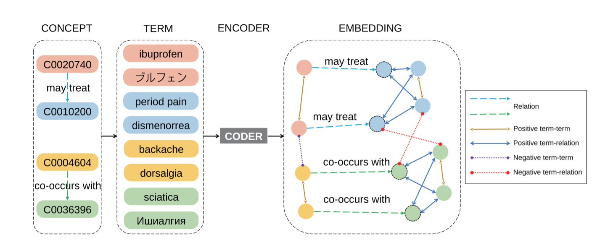
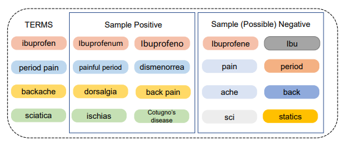

# CODER


CODER: Knowledge infused cross-lingual medical term embedding for term normalization. [Paper](http://arxiv.org/abs/2011.02947)



CODER++: Automatic Biomedical Term Clustering by Learning Fine-grained Term Representations. [Paper](https://arxiv.org/abs/2204.00391)

# Use the model by transformers
Models have been uploaded to huggingface/transformers repo.

```python
from transformers import AutoTokenizer, AutoModel

tokenizer = AutoTokenizer.from_pretrained("GanjinZero/UMLSBert_ENG")
model = AutoModel.from_pretrained("GanjinZero/UMLSBert_ENG")
```
English checkpoint: **GanjinZero/coder_eng** or GanjinZero/UMLSBert_ENG (old name)

English checkpoint CODER++: **GanjinZero/coder_eng_pp** (with hard negative sampling)
<!-- Please try to use transformers 3.4.0 to load CODER++, we find the model loaded in transformers 4.12.0 behave differently! -->

Multilingual checkpoint: **GanjinZero/coder_all** ~~or GanjinZero/UMLSBert_ALL  (discarded old name)~~

# Train your model
```shell
cd pretrain
python train.py --umls_dir your_umls_dir --model_name_or_path monologg/biobert_v1.1_pubmed
```
your_umls_dir should contain **MRCONSO.RRF**, **MRREL.RRF** and **MRSTY.RRF**.
UMLS Download path:[UMLS](https://www.nlm.nih.gov/research/umls/licensedcontent/umlsarchives04.html#2020AA).

# A small tool for load UMLS RRF
```python
from pretrain.load_umls import UMLS
umls = UMLS(your_umls_dir)
```

# Test CODER or other embeddings
## CADEC
```shell
cd test
python cadec/cadec_eval.py bert_model_name_or_path
python cadec/cadec_eval.py word_embedding_path
```

## MANTRA GSC
Download [the Mantra GSC](https://files.ifi.uzh.ch/cl/mantra/gsc/GSC-v1.1.zip) and unzip the xml files to /test/mantra/dataset, run
```
cd test/mantra
python test.py
```

## MCSM
```shell
cd test/embeddings_reimplement
python mcsm.py
```

## DDBRC
Only sampled data is provided.
```shell
cd test/diseasedb
python train.py your_embedding embedding_type freeze_or_not gpu_id
```
- embedding_type should be in [bert, word, cui]
- freeze_or_not should be in [T, F], T means freeze the embedding, and F means fine-tune the embedding

# Citation
```bibtex
@article{YUAN2022103983,
title = {CODER: Knowledge-infused cross-lingual medical term embedding for term normalization},
journal = {Journal of Biomedical Informatics},
pages = {103983},
year = {2022},
issn = {1532-0464},
doi = {https://doi.org/10.1016/j.jbi.2021.103983},
url = {https://www.sciencedirect.com/science/article/pii/S1532046421003129},
author = {Zheng Yuan and Zhengyun Zhao and Haixia Sun and Jiao Li and Fei Wang and Sheng Yu},
keywords = {medical term normalization, cross-lingual, medical term representation, knowledge graph embedding, contrastive learning}
}
```

```bibtex
@inproceedings{zeng-etal-2022-automatic,
    title = "Automatic Biomedical Term Clustering by Learning Fine-grained Term Representations",
    author = "Zeng, Sihang  and
      Yuan, Zheng  and
      Yu, Sheng",
    booktitle = "Proceedings of the 21st Workshop on Biomedical Language Processing",
    month = may,
    year = "2022",
    address = "Dublin, Ireland",
    publisher = "Association for Computational Linguistics",
    url = "https://aclanthology.org/2022.bionlp-1.8",
    pages = "91--96",
    abstract = "Term clustering is important in biomedical knowledge graph construction. Using similarities between terms embedding is helpful for term clustering. State-of-the-art term embeddings leverage pretrained language models to encode terms, and use synonyms and relation knowledge from knowledge graphs to guide contrastive learning. These embeddings provide close embeddings for terms belonging to the same concept. However, from our probing experiments, these embeddings are not sensitive to minor textual differences which leads to failure for biomedical term clustering. To alleviate this problem, we adjust the sampling strategy in pretraining term embeddings by providing dynamic hard positive and negative samples during contrastive learning to learn fine-grained representations which result in better biomedical term clustering. We name our proposed method as CODER++, and it has been applied in clustering biomedical concepts in the newly released Biomedical Knowledge Graph named BIOS.",
}
```
